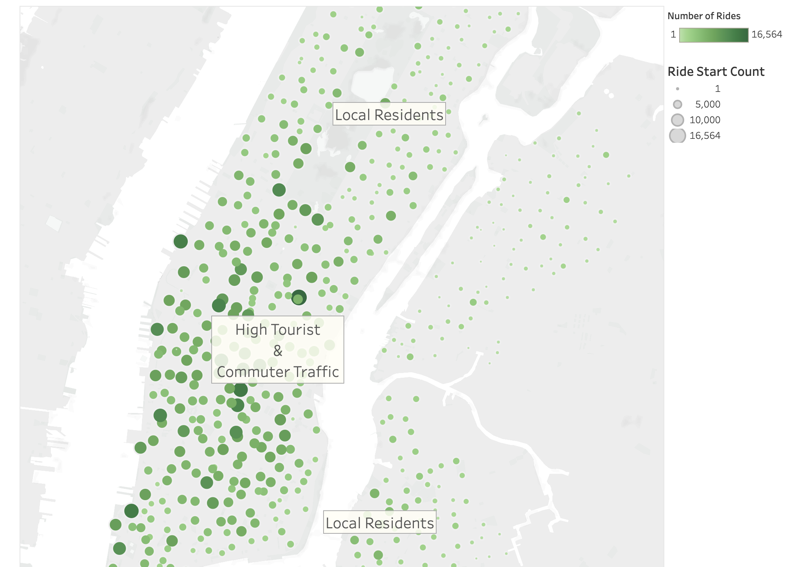

# bikesharing

To see the interactive Tableau workbook [link to dashboard](https://public.tableau.com/app/profile/damien.franco/viz/NYCCitiBikeAnalysis_16447248805250/NYCCitiBikeAnalysis)

## Overview
CitiBike is a bike-sharing service in New York City that provides data for the following project. CitiBike data was used to supply investors seeking to start a bikeshare program in Des Moines, Iowa, with a framework for analysis.

While Des Moines is far removed from the bustle of New York, this research might still prove useful by answering the following questions:

- Who uses bikeshare services?
- Where do most of the city's bikeshare trips originate?
- When do cyclists use their bikes the most and the least?
- How often do the bikes get used, and by whom?

## Results

While Des Moines' demographics differ from those of NYC, a quick examination of CitiBike riders may reveal who bike-sharing might attract, regardless of location.

In the graphic above, we can see that more than 75% of the riders are subscribers. This is great for regular and reliable income on a month by month basis. We also see that the gender ratio of bikeshare users skews heavily male and may be helpful in marketing and customer acquisition.

The map above shows the bike stations from which recorded bike trips began. The size of the circles relates to the number of trips begun at those locations, with greater diameter indicating a higher volume of usage. We see that most rides begin in densely populated areas with commercial buildings and entertainment which suggests any city starting a bike-sharing program consider dense population as opposed to suburbs or rural areas.

The number of bike trips started each hour throughout the month of August is shown in this graph. Morning rush hour and end-of-day commute times are when usage spikes. The low-usage hours between 2 AM and 5 AM are also worth noting. These hours would be excellent for performing bicycle maintenance and redistribution of bikes from full stations to empty ones.

A heatmap can also show us weekly usage habits. Once more, we observe heavy bicycle usage during weekday commutes, with weekend usage dispersed across the middle of the day. Wednesday's end-of-day commute exhibits an oddity in terms of how little cycling is used. It may be useful to dig deeper (system outage, August holidays, etc) to determine the reason for this drop in use.

Finally, we can see that weekends exhibit a very different usage pattern than weekdays. It may be helpful to target marketing efforts differently depending on whether it is a weekday or weekend. Tourism could very well be a factor that should be looked at further.

We can check out the percentage of bikes that get a lot of mileage by looking at this stepped-level heatmap. This tiling displays each bike in the fleet, including its size, color, and degree of usage throughout the month. Red indicators suggest that a number of the bikes will require more frequent maintenance or perhaps even replacement. It may be worth considering a plan for even distribution during off-peak hours depending on cost analysis of distribution vs repairs.

The charting of average trip duration by birth year reveals a couple of insights: the bikeshare user base includes people from all age groups, from teenagers to the elderly, and teenagers and early-twenty-somethings take longer bike excursions than older users.

Number of trips per duration presents that the vast majority of CitiBike journeys are less than an hour in length. More particularly, the greatest proportion of trips are less than a half-hour long, with fewer rides over an hour in length. This is likely caused by short commuters living in densely populated areas that live near their work place.

This distribution of rides by duration, separated by gender, demonstrates just how many more excursions are taken by male-identifying clients. Further analysis of fall and spring months is suggested to uncover whether the heat of August is a deterrent for female bike riding to work.

Finally, this heatmap demonstrates how male-identifying, subscribing users make up the majority of the user base. Again, further research is suggested to uncover if this is seasonal or not.

## Summary

Our findings suggest that busy metropolitan areas with a lot of people provide the right environment for bikeshare systems to be popular. The majority of users are male and are subscribers that provide continuous income to the system. Female riders could be targeted with more outreach and marketing while male participants appear to be a constant market. And during peak commute hours, most bikes are picked up and dropped off quickly.

### Insights:

- CitiBike is used more during rush hours, with a dip in use at night and on the weekends.  - Most riders are men between the ages of 26 and 54 that subscribe to the service.  - The majority of rides last less than an hour--and almost half are less than half an hour.  - Most riders live and work within the CitiBike service area, indicating a system that is meant for short metropolitan commutes.